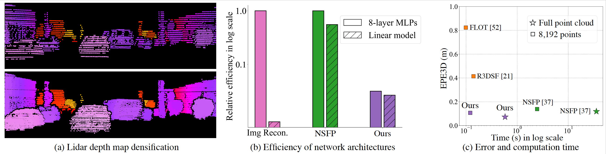

# FastNSF -- Fast Neural Scene Flow


[](https://opensource.org/licenses/MIT)

[Xueqian Li](https://lilac-lee.github.io/), [Jianqiao Zheng](https://scholar.google.com/citations?user=R8d2QOsAAAAJ&hl=en&oi=ao), [Francesco Ferroni](https://www.francescoferroni.com/), [Jhony Kaesemodel Pontes](https://jhonykaesemodel.com/), 
[Simon Lucey](https://scholar.google.com.au/citations?user=vmAe35UAAAAJ&hl=en).

19th International Conference on Computer Vision (**ICCV, 2023**)

Project page: https://Lilac-Lee.github.io/FastNSF

arXiv link: https://arxiv.org/pdf/2304.09121.pdf


### Update:

- [x] update installation packages.
- [x] test all commands.
- [x] update Waymo Open dataset processing instructions.
- [x] update project page.

---



Scene flow is an important problem as it provides low-level motion cues for many downstream tasks.
State-of-the-art learning methods are usually fast and can achieve impressive performance on in-domain data, but usually fail to generalize to out-of-the-distribution (OOD) data or handle dense point clouds.
In this paper, we focus on a runtime optimization-based neural scene flow pipeline. In (a) one can see its application in the densification of lidar. 
However, in (c) one sees that the major drawback is the extensive computation time.
We identify that the common speedup strategy in network architectures for coordinate networks has little effect on scene flow acceleration [see green (b)] unlike image reconstruction [see pink (b)].
With the dominant computational burden stemming instead from the Chamfer loss function, we propose to use a distance transform-based loss function to accelerate [see purple (b)], which achieves up to 30$\times$ speedup and on-par estimation performance compared to NSFP [see (c)].
When tested on 8k points, it is as efficient [see (c)] as leading learning methods, achieving real-time performance.

---

### Prerequisites
This code is based on PyTorch implementation, and tested on PyTorch=1.13.0, Python=3.10.8 with CUDA 11.6 or PyTorch=1.12.0, Python=3.9.15 with CUDA 11.6. 
But it should work fine with higher version of PyTorch.

A simple installation is ```bash ./install.sh```.

For a detailed installation guide, please go to [requirements.yml](requirements.yml).


### Dataset
We provide datasets we used in our paper.
You may download datasets used in the paper from these links:

- [Argoverse](https://drive.google.com/file/d/1qyTaLz1_CTF3IB1gr3XpIiIDh6klQOA4/view?usp=sharing) (370MB)

- [Waymo Open](https://drive.google.com/file/d/1urONegaI6pS47bUv-Kw0nl0oGFzGfIl2/view?usp=sharing) (453MB)

After you download the dataset, you can create a symbolic link in the ./dataset folder as ```./dataset/argoverse``` and ```./dataset/waymo```.
<br></br>
#### **UPDATE**: for Argoverse scene flow dataset preprocessing, please refer to [Neural Scene Flow Prior](https://github.com/Lilac-Lee/Neural_Scene_Flow_Prior); for Waymo Open scene flow dataset preprocessing, please refer to [this instruction](utils/WAYMO_OPEN_README.md).

---


### 2D BEV scene flow optimization demo
[](https://colab.research.google.com/drive/14P8l8x36yzHUFsddTt2pCmc3wLIunZWQ?usp=sharing)


Local source notebook could be found [here](demo/optimize_2d_fastNSF_dt.ipynb).


---
### Optimization

- Waymo Open scene flow dataset
    #### 1. using full point cloud
    ```
    python optimization.py --device cuda:0 --dataset WaymoOpenSceneFlowDataset --dataset_path ./dataset/waymo --exp_name opt_waymo_open_full_points --batch_size 1 --iters 5000 --use_all_points --model neural_prior --hidden_units 128 --layer_size 8 --lr 0.008 --act_fn relu --earlystopping --early_patience 10 --early_min_delta 0.001 --grid_factor 10 --init_weight
    ```

    #### 2. 8,192 points experiment
    ```
    python optimization.py --device cuda:0 --dataset WaymoOpenSceneFlowDataset --dataset_path ./dataset/waymo --exp_name opt_waymo_open_full_points --batch_size 1 --iters 5000 --num_points 8192 --model neural_prior --hidden_units 128 --layer_size 8 --lr 0.01 --act_fn relu --earlystopping --early_patience 5 --early_min_delta 0.001 --grid_factor 10 --init_weight
    ```

    #### 3. using Kronecker PE + linear model
    ```
    python opt_linear.py --device cuda:0 --dataset WaymoOpenSceneFlowDataset --dataset_path ./dataset/waymo --exp_name opt_waymo_open_full_points_linear --batch_size 1 --iters 5000 --use_all_points --lr 0.03 --earlystopping --early_patience 10 --early_min_delta 0.001 --gauss_sigma 6.0 --grid_factor 0.5 --reg_scaling 0.5 --dt_grid_factor 10 --init_weight
    ```

- Argoverse scene flow dataset
    #### 1. using full point cloud
    ```
    python optimization.py --device cuda:0 --dataset ArgoverseSceneFlowDataset --dataset_path ./dataset/argoverse --exp_name opt_argoverse_full_points --batch_size 1 --iters 5000 --use_all_points --model neural_prior --hidden_units 128 --layer_size 8 --lr 0.008 --act_fn relu --earlystopping --early_patience 10 --early_min_delta 0.001 --grid_factor 10 --init_weight
    ```

    #### 2. 8,192 points experiment
    ```
    python optimization.py --device cuda:0 --dataset ArgoverseSceneFlowDataset --dataset_path ./dataset/argoverse --exp_name opt_argoverse_8192_points --batch_size 1 --iters 5000 --num_points 8192 --model neural_prior --hidden_units 128 --layer_size 8 --lr 0.01 --act_fn relu --earlystopping --early_patience 5 --early_min_delta 0.001 --grid_factor 10 --init_weight
    ```

    #### 3. using Kronecker PE + linear model
    ```
    python opt_linear.py --device cuda:0 --dataset ArgoverseSceneFlowDataset --dataset_path ./dataset/argoverse --exp_name opt_argoverse_full_points_linear --batch_size 1 --iters 5000 --use_all_points --lr 0.03 --earlystopping --early_patience 10 --early_min_delta 0.001 --gauss_sigma 5.0 --grid_factor 0.5 --reg_scaling 0.5 --dt_grid_factor 10 --init_weight
    ```


---


### Acknowledgement
[Neural Scene Flow Prior](https://github.com/Lilac-Lee/Neural_Scene_Flow_Prior)

[FastGeodis: Fast Generalised Geodesic Distance Transform](https://github.com/masadcv/FastGeodis)


### Contributing
If you find the project useful for your research, you may cite,
```
@InProceedings{Li_2023_ICCV,
  title={Fast Neural Scene Flow},
  author={Li, Xueqian and Zheng, Jianqiao and Ferroni, Francesco and Pontes, Jhony Kaesemodel and Lucey, Simon},
  booktitle={Proceedings of the IEEE/CVF International Conference on Computer Vision (ICCV)},
  month={October},
  year={2023},
  pages={9878-9890}
}
```
